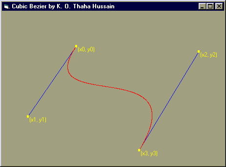

<div align="center">

## a   \-Photoshop Pen Tool \- Underlying Technique \* Maths Behind Bezier Curve \*  By K\.O\. Thaha Hussain


</div>

### Description

Explains how we can draw a Bezier Curve! The maths behind a Cubic Bezier.Very simple. No API's used.

Key words : paint brush, draw, curve, graphics, picture, technique, smooth curve
 
### More Info
 


<span>             |<span>
---                |---
**Submitted On**   |
**By**             |[K\. O\. Thaha Hussain](https://github.com/Planet-Source-Code/PSCIndex/blob/master/ByAuthor/k-o-thaha-hussain.md)
**Level**          |Intermediate
**User Rating**    |4.5 (54 globes from 12 users)
**Compatibility**  |VB 5\.0, VB 6\.0
**Category**       |[Graphics](https://github.com/Planet-Source-Code/PSCIndex/blob/master/ByCategory/graphics__1-46.md)
**World**          |[Visual Basic](https://github.com/Planet-Source-Code/PSCIndex/blob/master/ByWorld/visual-basic.md)
**Archive File**   |[](https://github.com/Planet-Source-Code/k-o-thaha-hussain-a-photoshop-pen-tool-underlying-technique-maths-behind-bezier-curve-by-k__1-22556/archive/master.zip)


### Source Code

```
'CubicBezier Demo by K.O. Thaha Hussain
' Anlyst Programmer
'(C) 2001. All rights reserved
' URL : http://www.bcity.com/thahahussain
' E-mail : thaha_ko@yahoo.com
' Company : http://www.induswareonline.com
'A cubic Bezier curve is defined by four points.
'(x0,y0) & (x3,y3) are endpoints and
'(x1,y1) & (x2,y2) are control points.
'The following equations define the points
'on the curve.
'Both are evaluated for an arbitrary number of values
' of t between 0 and 1.
'
' X(t) = ax * t ^ 3 + bx * t ^ 2 + cx * t + x0
'
' X1 = x0 + cx / 3
' X2 = X1 + (cx + bx) / 3
' x3 = x0 + cx + bx + ax
'
' Y(t) = ay * t ^ 3 + by * t ^ 2 + cy * t + y0
'
' Y1 = y0 + cy / 3
' Y2 = Y1 + (cy + by) / 3
' y3 = y0 + cy + by + ay
Option Explicit
Dim HitCounter As Integer
Dim XPoint(3) As Integer, YPoint(3) As Integer
Dim Drag As Boolean
Private Sub DrawBezier()
Dim ax, bx, cx, ay, by, cy, xt, yt, t, I As Integer
On Error Resume Next
Me.Cls
Me.DrawWidth = 1
'Draws control lines
Me.ForeColor = vbBlue
Me.Line (XPoint(1), YPoint(1))-(XPoint(0), YPoint(0))
Me.Line (XPoint(2), YPoint(2))-(XPoint(3), YPoint(3))
Me.ForeColor = vbRed
'The following is the core of the program.
' All others are just for dragging.
 cx = 3 * (XPoint(1) - XPoint(0))
 bx = 3 * (XPoint(2) - XPoint(1)) - cx
 ax = XPoint(3) - XPoint(0) - cx - bx
 cy = 3 * (YPoint(1) - YPoint(0))
 by = 3 * (YPoint(2) - YPoint(1)) - cy
 ay = YPoint(3) - YPoint(0) - cy - by
For t = 0 To 1 Step 0.001
 xt = ax * t ^ 3 + bx * t ^ 2 + cx * t + XPoint(0)
 yt = ay * t ^ 3 + by * t ^ 2 + cy * t + YPoint(0)
 Form1.PSet (xt, yt) 'Draw Lines for a finer curve
Next t
Me.ForeColor = vbYellow
Me.DrawWidth = 4
For I = 0 To 3
Me.PSet (XPoint(I), YPoint(I))
Print " (x" & I & ", y" & I & ")"
Next I
End Sub
Private Sub Form_Load()
Me.ScaleMode = vbTwips
MsgBox "Put four points and drag them to adjust the" & _
 "curve..", , "Cubic Bezier Demo"
Me.Caption = "Cubic Bezier by K. O. Thaha Hussain"
End Sub
Private Sub Form_MouseMove(Button As Integer, _
 Shift As Integer, X As Single, Y As Single)
 If CheckHit(X, Y) And Button = vbLeftButton Then
 XPoint(HitCounter) = X
 YPoint(HitCounter) = Y
 Call DrawBezier
 Drag = True
 Else
 Drag = False
 End If
End Sub
Private Sub Form_MouseUp(Button As Integer, _
 Shift As Integer, X As Single, Y As Single)
Static count As Integer
If count > 3 Then
 Call DrawBezier
 Exit Sub
End If
XPoint(count) = X
YPoint(count) = Y
If count = 3 Then Call DrawBezier
count = count + 1
Drag = False
End Sub
Function CheckHit(C As Single, V As Single) As Boolean
Dim I As Integer
If Drag Then
 CheckHit = True
 Exit Function
End If
 For I = 0 To 3
 'if the mouse pointer approaches the points..
 If ((Abs(C - XPoint(I)) < 50 And Abs(V - YPoint(I)) < 50)) Then
 Me.MousePointer = vbCrosshair
 CheckHit = True
 HitCounter = I
 Exit Function
 Else
 Me.MousePointer = vbDefault
 CheckHit = False
 End If
 Next I
End Function
```

